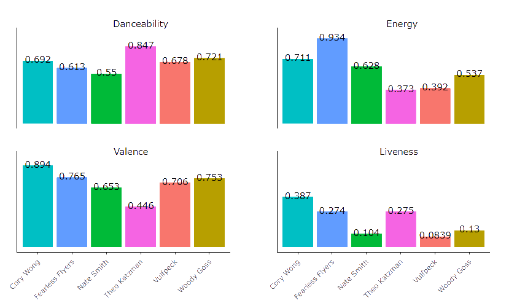

```{r setup, include=FALSE, cache = TRUE}
knitr::opts_chunk$set(echo = FALSE)
```

```{r, include=FALSE}
library(tibble)
library(tidyverse)
library(spotifyr)
library(gridExtra)
library(flexdashboard)
library(readr)
library(leaflet)
library(DT)
library(lubridate)
library(plotly)
library(gridExtra)
library(grid)
library(ggplot2)
library(lattice)
library(compmus)
library(tidymodels)
library(ggdendro)
library(heatmaply)

```

```{r}
vulfpeck <- get_playlist_audio_features("", "3nI3zFZc0zNawgGGBvlLjd")
corywong <- get_playlist_audio_features("", "63WEX3nqvVWQM08k4GOdpY")
katzman <- get_playlist_audio_features("", "26kcyNqQKAN3fnuO8NCL4B")
fearless <- get_playlist_audio_features("", "67Zq8kPS6CmIcBZYEIy5JL")
nate <- get_playlist_audio_features("", "3PcaerIEOjHbo56TmnR62I")
nate <- nate[!is.na(nate$playlist_id),]
woody <- get_playlist_audio_features("", "1YNoeB7YRKmwXDwxL6kXHv")


# summary(vulfpeck)

artists <-
  bind_rows(
    vulfpeck %>% mutate(category = "Vulfpeck"),
    corywong %>% mutate(category = "Cory Wong"),
    katzman %>% mutate(category = "Katzman"),
    fearless %>% mutate(category= "Fearless"),
    woody %>% mutate(category = "Woody"),
    nate %>% mutate(category = "Nate")
  )

artists <- artists %>% mutate(artist_track = paste(category, track.name))

```

```{r cars}
circshift <- function(v, n) {
  if (n == 0) v else c(tail(v, n), head(v, -n))
}

#      C     C#    D     Eb    E     F     F#    G     Ab    A     Bb    B
major_chord <-
  c(   1,    0,    0,    0,    1,    0,    0,    1,    0,    0,    0,    0)
minor_chord <-
  c(   1,    0,    0,    1,    0,    0,    0,    1,    0,    0,    0,    0)
seventh_chord <-
  c(   1,    0,    0,    0,    1,    0,    0,    1,    0,    0,    1,    0)

major_key <-
  c(5.0, 2.0, 3.5, 2.0, 4.5, 4.0, 2.0, 4.5, 2.0, 3.5, 1.5, 4.0)
minor_key <-
  c(5.0, 2.0, 3.5, 4.5, 2.0, 4.0, 2.0, 4.5, 3.5, 2.0, 1.5, 4.0)

chord_templates <-
  tribble(
    ~name, ~template,
    "Gb:7", circshift(seventh_chord, 6),
    "Gb:maj", circshift(major_chord, 6),
    "Bb:min", circshift(minor_chord, 10),
    "Db:maj", circshift(major_chord, 1),
    "F:min", circshift(minor_chord, 5),
    "Ab:7", circshift(seventh_chord, 8),
    "Ab:maj", circshift(major_chord, 8),
    "C:min", circshift(minor_chord, 0),
    "Eb:7", circshift(seventh_chord, 3),
    "Eb:maj", circshift(major_chord, 3),
    "G:min", circshift(minor_chord, 7),
    "Bb:7", circshift(seventh_chord, 10),
    "Bb:maj", circshift(major_chord, 10),
    "D:min", circshift(minor_chord, 2),
    "F:7", circshift(seventh_chord, 5),
    "F:maj", circshift(major_chord, 5),
    "A:min", circshift(minor_chord, 9),
    "C:7", circshift(seventh_chord, 0),
    "C:maj", circshift(major_chord, 0),
    "E:min", circshift(minor_chord, 4),
    "G:7", circshift(seventh_chord, 7),
    "G:maj", circshift(major_chord, 7),
    "B:min", circshift(minor_chord, 11),
    "D:7", circshift(seventh_chord, 2),
    "D:maj", circshift(major_chord, 2),
    "F#:min", circshift(minor_chord, 6),
    "A:7", circshift(seventh_chord, 9),
    "A:maj", circshift(major_chord, 9),
    "C#:min", circshift(minor_chord, 1),
    "E:7", circshift(seventh_chord, 4),
    "E:maj", circshift(major_chord, 4),
    "G#:min", circshift(minor_chord, 8),
    "B:7", circshift(seventh_chord, 11),
    "B:maj", circshift(major_chord, 11),
    "D#:min", circshift(minor_chord, 3)
  )

key_templates <-
  tribble(
    ~name, ~template,
    "Gb:maj", circshift(major_key, 6),
    "Bb:min", circshift(minor_key, 10),
    "Db:maj", circshift(major_key, 1),
    "F:min", circshift(minor_key, 5),
    "Ab:maj", circshift(major_key, 8),
    "C:min", circshift(minor_key, 0),
    "Eb:maj", circshift(major_key, 3),
    "G:min", circshift(minor_key, 7),
    "Bb:maj", circshift(major_key, 10),
    "D:min", circshift(minor_key, 2),
    "F:maj", circshift(major_key, 5),
    "A:min", circshift(minor_key, 9),
    "C:maj", circshift(major_key, 0),
    "E:min", circshift(minor_key, 4),
    "G:maj", circshift(major_key, 7),
    "B:min", circshift(minor_key, 11),
    "D:maj", circshift(major_key, 2),
    "F#:min", circshift(minor_key, 6),
    "A:maj", circshift(major_key, 9),
    "C#:min", circshift(minor_key, 1),
    "E:maj", circshift(major_key, 4),
    "G#:min", circshift(minor_key, 8),
    "B:maj", circshift(major_key, 11),
    "D#:min", circshift(minor_key, 3)
  )
```

Introduction
=========================================================================

```{r, echo=FALSE}
# Define variable containing url
url <- "https://media.ticketmaster.com/tm/en-us/dam/a/b1f/f8c61ced-7670-4495-8a8f-15b66cf9db1f_247161_CUSTOM.jpg"
```
<center></center>

::: {.center data-latex=""}
This portfolio explores the albums Vulfpeck, their members and collaborators. Vulfpeck’s Joe Dart is praised as one of the best bassists to emerge in recent years, but that’s not the only reason for this choice. Firstly, Vulfpeck is known for their one-take style of recording and off-beat musical style. Secondly, the band has a few closely associated members that appear on a large section of their music. Finally, the band’s members have their own solo projects which often still feature each other. This allows us to compare the albums of these artists and see what makes their music unique. This is the main goal of the analysis in this corpus.

o

The natural groups in the corpus are as follows. Vulfpeck, Theo Katzmann, Woody Goss, Cory Wong, The Fearless Flyers and Nate Smith. Each of these categories consists of at least 3 albums and almost all albums feature the other artists. Though they share a band there are some clear differences in genre, Vulfpeck is primarily funk, Theo Katzman is more slow love songs, Cory Wong has the danceability of pop music, Woody Goss is minimalistic and has a more straight feel, The Fearless Flyers is extremely high energy and fast paced and Nate Smith's solo work is odd-timed and syncopated heavy drumming.

o

It will be interesting to find out what makes each artists music truly theirs, even though they are so closely related and collaborative.

o

Below you will find a short description of each artists and a typical song of theirs.  

v

:::

```{r, echo=FALSE}
# Define variable containing url
url <- "https://media.ticketmaster.com/tm/en-us/dam/a/b1f/f8c61ced-7670-4495-8a8f-15b66cf9db1f_247161_CUSTOM.jpg"
```
<center></center>

The Dataset {.storyboard}
=========================================================

### What about these typical songs? A closer look at some track-level features {data-commentary-width=500}

<center></center>

```{r}
typical <- get_playlist_audio_features("", "4WHMUcKSa9QUXnfk7BGVZj")

ja <- c("Vulfpeck", "Woody Goss", "Theo Katzman", "Cory Wong", "Nate Smith", "Fearless Flyers")

typical$artist=ja

dance <- ggplot(typical, aes(x=artist, y=danceability, fill = track.name, label=danceability,
                         text=paste("Song:",track.name, "\n", "Artist:", artist))) +
  geom_col() +
  theme_classic() +
  theme(legend.position = "none", axis.title.y=element_blank(),
        axis.text.y=element_blank(),
        axis.ticks.y=element_blank(), axis.text.x = element_text(angle = 45, vjust = 0.5, hjust=1),
         #panel.background = element_rect(fill = "#9bbede",    colour = "#9bbede")
        ) +
  labs(x ="", y="")+ 
  ylim(0,1) +
  geom_text(vjust=-.5)


p11 <- ggplotly(dance, tooltip = "text")

energy <- ggplot(typical, aes(x=artist, y=energy, fill = track.name, label=energy,
                         text=paste("Song:",track.name, "\n", "Artist:", artist))) +
  geom_col() +
  theme_classic() +
  theme(legend.position = "none", axis.title.y=element_blank(),
        axis.text.y=element_blank(),
        axis.ticks.y=element_blank(), axis.text.x = element_text(angle = 45, vjust = 0.5, hjust=1)) +
  labs(x ="", y="")+ 
  ylim(0,1) +
  geom_text(vjust=-.5)


p12 <- ggplotly(energy, tooltip = "text")

valence <- ggplot(typical, aes(x=artist, y=valence, fill = track.name, label=valence,
                         text=paste("Song:",track.name, "\n", "Artist:", artist))) +
  geom_col() +
  theme_classic() +
  theme(legend.position = "none", axis.title.y=element_blank(),
        axis.text.y=element_blank(),
        axis.ticks.y=element_blank(), axis.text.x = element_text(angle = 45, vjust = 0.5, hjust=1)) +
  labs(x ="", y="")+ 
  ylim(0,1) +
  geom_text(vjust=-.5)


p21 <- ggplotly(valence, tooltip = "text")

liveness <- ggplot(typical, aes(x=artist, y=liveness, fill = track.name, label=liveness,
                         text=paste("Song:",track.name, "\n", "Artist:", artist))) +
  geom_col() +
  theme_classic() +
  theme(legend.position = "none", axis.title.y=element_blank(),
        axis.text.y=element_blank(),
        axis.ticks.y=element_blank(), axis.text.x = element_text(angle = 45, vjust = 0.5, hjust=1)) +
  labs(x ="", y="")+ 
  ylim(0,0.7) +
  geom_text(vjust=-.5)


p22 <- ggplotly(liveness, tooltip = "text")


help <- subplot(dance, energy, valence, liveness, nrows=2, shareX = TRUE, margin=.05)  %>% layout(annotations = list(
  list(x = 0.2 , y = 1.05, text = "Danceability", showarrow = F, xref='paper', yref='paper'),
  list(x = 0.85 , y = 1.05, text = "Energy", showarrow = F, xref='paper', yref='paper'),
  list(x = 0.2 , y = 0.45, text = "Valence", showarrow = F, xref='paper', yref='paper'),
  list(x = 0.85 , y = 0.45, text = "Liveness", showarrow = F, xref='paper', yref='paper'))
)
p22

```

***

Here we see the typical songs for each artist as mentioned earlier depicted by four track-level features. Some of the things I noticed myself are also representedin the graph. 


The Fearless Flyers have the highest energy by far, while the love songs of Theo Katzman and the minimalist funk of Vulfpeck get low scores. 


For Theo Katzmans song the valence is also the lowest, which often corresponds to sad songs, much like the melancholy often felt when listening to love songs. 

The Dancability feature then seems odd in combination with the others. I would have expected Cory Wong to be the highest by far in this category. 


Cory Wong scores high in Valence however, perhaps it was my personal correlation between dancing and happiness, which is often said to be represented by a combination of valence and energy in music. 


Finally, Nate Smith scores lowest in Liveness. The track used is a solo drum track, which might explain the low score due to a lack of noise in the recording.

We are certainly gaining some insight into the differences between the artists, but these are just some typical tracks. Lets look at the bigger picture!


### Lets see what emotions best describes each artist

```{r, fig.width = 12, fig.height=6}
mood <- artists %>% ggplot(aes(x = valence, y = energy, size=2 , alpha= 0.5, color = category)) +
  geom_jitter(alpha = 0.6) + geom_hline(yintercept = 0.5) + geom_vline(xintercept = 0.5)

mood <- mood + annotate(
  "text",
  x = 0.90, y = 0.95,
  label = "Happy",
  vjust = 1, size = 3
)
mood <- mood + annotate(
  "text",
  x = 0.1, y = 0.95,
  label = "Angry",
  vjust = 1, size = 3
)
mood <- mood + annotate(
  "text",
  x = 0.1, y = 0.1,
  label = "Sad",
  vjust = 1, size = 3
)
mood <- mood + annotate(
  "text",
  x = 0.90, y = 0.1,
  label = "Calm",
  vjust = 1, size = 3
)
mood +
    theme_classic() +
  theme(axis.text.y=element_blank(), axis.text.x=element_blank(), plot.background = element_rect(fill = "#9bbede"), panel.background = element_rect(fill = "#FCF6F5FF"), legend.background = element_rect(fill="#9bbede")) +
  labs(title="Valence vs Energy", x ="", y="") +
  guides(size=FALSE)
```

***

Here we see the entire dataset plotted based on valence on the x-axis and energy on the y-axis.

We can already begin to see some larger patterns. Most of the music is happy, and you can see that Fearless Flyers music actually never leaves the happy quadrant. Cory Wongs music also rarely does, but sometimes has a lower valence and ends up in theh angry quadrant.

You can clearly see Theo Katzman, Vulfpeck and Woody Goss are on the lower side of the graph. Overall they have less energy. For Theo Katzmann this is because of the style of music he usually plays, which is half-time smooth love songs. Woody Goss' and Vulfpeck's reason is most likely the minimalist production they use. Short notes and interesting rests in the music are something that makes their music uniqie.

Nate Smith is the only one who shows a clear pattern of low valence and high energy. This somewhat understandable, a lot of his music features heavy drum parts which in audio analysis often leads to high and intense peaks. It is difficult to descibe how one would express valence in terms of drums.


### Major and Minor modes are often associated with happy and sad, perhaps that is the explanation?

```{r, fig.width = 12, fig.height=8}
advanced <- artists %>%                    # Start with awards.
  mutate(
    mode = ifelse(mode == 0, "Minor", "Major")
  ) %>%
  ggplot(                     # Set up the plot.
    aes(
      x = tempo,
      y = loudness,
      size = loudness,
      colour = mode
    )
  ) +
  geom_point(alpha = 0.5) +
  facet_wrap(~category) +
  ylim(-12,-4) +
  scale_colour_brewer(        # Use the Color Brewer to choose a palette.
    type = "qual",            # Qualitative set.
    palette = "Set1"        # Name of the palette is 'Paired'.
  ) +             # Use a simpler theme.
  labs(                       # Make the titles nice.
    x = "Tempo",
    y = "Loudness",
    colour = "Mode"
  )
kop <-advanced+
  theme_classic() +
  theme(legend.position = "none",
        axis.text.y=element_blank(),
        axis.ticks.y=element_blank(), axis.text.x = element_text(angle = 45, vjust = 0.5, hjust=1),
        plot.background = element_rect(fill = "#9bbede"), panel.background = element_rect(fill = "#FCF6F5FF"), legend.background = element_rect(fill="#9bbede"),
        strip.background = element_blank()) +
  labs(x ="Tempo", y="Loudness")


kop

```

***

Tempo and Loundess seem to have little correlation. We can however see that for most artists songs that are high in both tempo and loudness have a higher chance of being in a major key.

### Combining Mode with Key

```{r}
artists %>%
  ggplot(                     # Set up the plot.
    aes(
      x = key_name,
      y = stat(count),
      label = key_name,
      fill = mode_name
    )
  ) +
  facet_wrap(~category) +
  geom_bar() +
  theme_classic() +
  theme(legend.position = "none",
        axis.text.y=element_blank(),
        axis.ticks.y=element_blank(), axis.text.x = element_text(angle = 45, vjust = 0.5, hjust=1),
        plot.background = element_rect(fill = "#9bbede"), panel.background = element_rect(fill = "#FCF6F5FF"), legend.background = element_rect(fill="#9bbede"),
        strip.background = element_blank()) +
  labs(x ="", y="") +
  labs(
    x = "Key",
    y = "",
    title = "Key and Mode",
    fill = "Mode"
  ) + 
  scale_fill_discrete(name = "Mode", labels = c("Major", "Minor"))

```

***

Although the distribution is clearly not random, the modes used don't seem to correspond with the, perhaps too simple, assumption that we can explain the emotion of the music using just the mode.

We can clearly see Theo Katzman uses almost exclusively Major keys, but still his songs were relatively low energy and valence compared to the other groups, which feature a lot more Minor keys.

Cory Wong, whose music I find the most uplifting of all, has relatively many minor keys.

One thing that is striking is the identical gap in keys between Vulfpeck and the Fearless Flyers for the keys of D# and E. Both these bands feature Joe Dart, perhaps he doesn't like those keys very much?

Funnily enough, in his solo repetoire Cory Wong also doesn't prefer d#, but does have a few songs in E.

Tempo {.storyboard}
========================================================================

### Different genres have different tempi, what's our dataset like?

```{r}

hist1 <- ggplot(data = artists, mapping = aes(x = tempo)) + 
  geom_density(aes(fill = category), position="stack", adjust=1/10) +
  geom_vline(xintercept=106, color="red", lwd=1) +
  geom_text(aes(x=c(120), y=c(0.2), label="106bpm", text="106 BPM")) +
  theme_classic() +
  theme(
        axis.text.y=element_blank(),
        axis.ticks.y=element_blank(), axis.text.x = element_text(angle = 45, vjust = 0.5, hjust=1),
        plot.background = element_rect(fill = "#9bbede"), panel.background = element_rect(fill = "#FCF6F5FF"), legend.background = element_rect(fill="#9bbede"),
        strip.background = element_blank()) +
  ggtitle("Tempos") +
  theme(legend.position="none")

hist1
```

***

We see the mode tempo for this dataset is 106 BPM. Compared to popular music, whose average tempo has risen up to 120 BPM in recent years, this is on the slower side.

There are also smaller peaks around 70, 90, 130, 155 and 170 BPM. 

We can see that the graph is slightly left skewed which indicates that lower tempos are more constant, while higher tempos are more variable.
.

.

.

.

.

.

### And how do the categories differ?

```{r}
hist3 <- ggplot(data = artists, mapping = aes(x = tempo, y = category, fill = category)) + 
  geom_violin(scale = "area", width=1, trim=FALSE, adjust = .25) +
#  geom_density(adjust=0.2) +
#  facet_wrap(~ category) +
#  geom_jitter(height = 0.1, width = 0) +
#  geom_boxplot(width=0.1, color="white") +
  stat_summary(fun.x=median, geom="point", size=2, color="red") +
  scale_x_continuous() +
  theme_classic() +
  theme(
        axis.text.y=element_blank(),
        axis.ticks.y=element_blank(), axis.text.x = element_text(angle = 45, vjust = 0.5, hjust=1),
        plot.background = element_rect(fill = "#9bbede"), panel.background = element_rect(fill = "#FCF6F5FF"), legend.background = element_rect(fill="#9bbede"),
        strip.background = element_blank()) +
  ggtitle("Tempo")

hist3
```

***

We can start to see Tempo might be a pretty good predictor in certain cases. Nate Smiths Music has a clear peak around 90 BPM. The Fearless Flyers also havea high tempo as their mode, around 130 BPM, which corresponds to my expectation mentioned earlier. This also explains the peak in the earlier graph.

Although there seem to be clear areasfor each plot, we can see the means are very close together. This is likely caused due to the outliers you can see in almost every group except for the Fearless Flyers.
.


.

.

.

.


Song Structure  {.storyboard}
=======================================================================

### Vulfpeck - 1612

```{r, fig.width = 12, fig.height=6}

#knitr::opts_chunk$set(fig.height = 9, fig.width = 7)

#knitr::opts_chunk$set(out.height = "\\textheight",  out.width = "\\textwidth")

toohot1 <-  get_tidy_audio_analysis("39rHfrVqCX6A55GF7uOZSC")%>% # Change URI.
  compmus_align(bars, segments) %>%                     # Change `bars`
  select(bars) %>%                                      #   in all three
  unnest(bars) %>%                                      #   of these lines.
  mutate(
    pitches =
      map(segments,
        compmus_summarise, pitches,
        method = "rms", norm = "manhattan"              # Change summary & norm.
      )
  ) %>%
  mutate(
    timbre =
      map(segments,
        compmus_summarise, timbre,
        method = "rms", norm = "manhattan"              # Change summary & norm.
      )
  )

l <- toohot1 %>%
  compmus_self_similarity(timbre, "manhattan") %>% 
  ggplot(
    aes(
      x = xstart + xduration / 2,
      width = xduration,
      y = ystart + yduration / 2,
      height = yduration,
      fill = d
    )
  ) +
  geom_tile() +
  coord_fixed() +
  scale_fill_viridis_c(option = 'A', guide = "none") +
  theme_classic() +
  theme(
        axis.text.y=element_blank(),
        axis.ticks.y=element_blank(), axis.text.x = element_text(angle = 45, vjust = 0.5, hjust=1),
        plot.background = element_rect(fill = "#9bbede"), panel.background = element_rect(fill = "#9bbede"), legend.background = element_rect(fill="#9bbede"),
        strip.background = element_blank()) +
  labs(x ="", y="", title="Timbre")

r <- toohot1 %>%
  compmus_self_similarity(pitches, "manhattan") %>% 
  ggplot(
    aes(
      x = xstart + xduration / 2,
      width = xduration,
      y = ystart + yduration / 2,
      height = yduration,
      fill = d
    )
  ) +
  geom_tile() +
  coord_fixed() +
  scale_fill_viridis_c(option = 'A', guide = "none") +
  theme_classic() +
  theme(
        axis.text.y=element_blank(),
        axis.ticks.y=element_blank(), axis.text.x = element_text(angle = 45, vjust = 0.5, hjust=1),
        plot.background = element_rect(fill = "#9bbede"), panel.background = element_rect(fill = "#9bbede"), legend.background = element_rect(fill="#9bbede"),
        strip.background = element_blank()) +
  labs(x ="", y="", title="Pitch")
lol <- arrangeGrob(l,r, ncol=2)

# final touch
cowplot::ggdraw(lol) + 
  theme(plot.background = element_rect(fill="#9bbede", color = "#9bbede"))
```

***

0-20 seconds

The song opens with a bass melody that continous throughout the song.

100-110 seconds

A vocal solo

140-140 seconds

Vocal fills

In the timbre-based self similarity matrix on the left we see a bright glow indicating that, overall, the timbre of the song is not very constant This is quite a surprise, the song features a bass and keyboard that can be heard throughout the song. Perhaps the combination of instruments and vocals create sounds that the analysis simply couldn't keep apart

The pitch-based self similarity matrix tells the opposite story. It is dark throughout, indicating a steady pitch, except for two key moments, which are caused by the vocal breaks. The vocals on this track are highly improvised which explains the clear difference with the repetitive melodies of the other instruments.

It's interesting to see that the vocals have such a high influence on the overall structure of the song

.

.

.

.

.

.

.

.

.


.

.

.

.

.


### The Fearless Flyers - Introducing The Fearless Flyers

```{r, fig.width = 12, fig.height=6}

#knitr::opts_chunk$set(fig.height = 9, fig.width = 7)

#knitr::opts_chunk$set(out.height = "\\textheight",  out.width = "\\textwidth")

toohot1 <-  get_tidy_audio_analysis("5EUbvbjJxC2Qe3DXDix8dl")%>% # Change URI.
  compmus_align(bars, segments) %>%                     # Change `bars`
  select(bars) %>%                                      #   in all three
  unnest(bars) %>%                                      #   of these lines.
  mutate(
    pitches =
      map(segments,
        compmus_summarise, pitches,
        method = "rms", norm = "manhattan"              # Change summary & norm.
      )
  ) %>%
  mutate(
    timbre =
      map(segments,
        compmus_summarise, timbre,
        method = "rms", norm = "manhattan"              # Change summary & norm.
      )
  )

l <- toohot1 %>%
  compmus_self_similarity(timbre, "manhattan") %>% 
  ggplot(
    aes(
      x = xstart + xduration / 2,
      width = xduration,
      y = ystart + yduration / 2,
      height = yduration,
      fill = d
    )
  ) +
  geom_tile() +
  coord_fixed() +
  scale_fill_viridis_c(option = 'A', guide = "none") +
  theme_classic() +
  theme(
        axis.text.y=element_blank(),
        axis.ticks.y=element_blank(), axis.text.x = element_text(angle = 45, vjust = 0.5, hjust=1),
        plot.background = element_rect(fill = "#9bbede"), panel.background = element_rect(fill = "#9bbede"), legend.background = element_rect(fill="#9bbede"),
        strip.background = element_blank()) +
  labs(x = "", y = "",title="Timbre")

r <- toohot1 %>%
  compmus_self_similarity(pitches, "manhattan") %>% 
  ggplot(
    aes(
      x = xstart + xduration / 2,
      width = xduration,
      y = ystart + yduration / 2,
      height = yduration,
      fill = d
    )
  ) +
  geom_tile() +
  coord_fixed() +
  scale_fill_viridis_c(option = 'A', guide = "none") +
  theme_classic() +
  theme(
        axis.text.y=element_blank(),
        axis.ticks.y=element_blank(), axis.text.x = element_text(angle = 45, vjust = 0.5, hjust=1),
        plot.background = element_rect(fill = "#9bbede"), panel.background = element_rect(fill = "#9bbede"), legend.background = element_rect(fill="#9bbede"),
        strip.background = element_blank()) +
  labs(x = "", y = "",title="Pitch")
lol <- arrangeGrob(l,r, ncol=2)

# final touch
cowplot::ggdraw(lol) + 
  theme(plot.background = element_rect(fill="#9bbede", color = "#9bbede"))
```

***

0-40 seconds
Main theme

Drum fill

50-70 seconds
Main theme again

Drum fill

80-110 seconds
Extended build up

120-140 seconds
Drum solo

The song here is clearly divided in 4 parts. The first two parts are very similar, which is also what you hear. The playing style is the same and this is reflected in the dark squares. Each part is divided by a drum fill which differs from the rest of the song. It features three string instruments at the same time. The final part of the song is a drum solo, it has little similarity with the rest of the track.

As for the melody, the same pattern is visible, but in a much more exagarated manner. The largest bright lines occur when there string section goes from fast strumming to a melodic build up with longer notes. The drums seem to have a high influence in the pitch similarity still as even the final part has a high similarity with the rest, even though it features little strings.
.

.

.

.

.

.

.

.

.


.

.

.

.

.


### Nate Smith- Big/Little Five

```{r, fig.width = 12, fig.height=6}

#knitr::opts_chunk$set(fig.height = 9, fig.width = 7)

#knitr::opts_chunk$set(out.height = "\\textheight",  out.width = "\\textwidth")

toohot1 <-  get_tidy_audio_analysis("5T5W7UzmLJljQUIJ7FxotZ")%>% # Change URI.
  compmus_align(bars, segments) %>%                     # Change `bars`
  select(bars) %>%                                      #   in all three
  unnest(bars) %>%                                      #   of these lines.
  mutate(
    pitches =
      map(segments,
        compmus_summarise, pitches,
        method = "rms", norm = "manhattan"              # Change summary & norm.
      )
  ) %>%
  mutate(
    timbre =
      map(segments,
        compmus_summarise, timbre,
        method = "rms", norm = "manhattan"              # Change summary & norm.
      )
  )

l <- toohot1 %>%
  compmus_self_similarity(timbre, "manhattan") %>% 
  ggplot(
    aes(
      x = xstart + xduration / 2,
      width = xduration,
      y = ystart + yduration / 2,
      height = yduration,
      fill = d
    )
  ) +
  geom_tile() +
  coord_fixed() +
  scale_fill_viridis_c(option = 'A', guide = "none") +
  theme_classic() +
  theme(
        axis.text.y=element_blank(),
        axis.ticks.y=element_blank(), axis.text.x = element_text(angle = 45, vjust = 0.5, hjust=1),
        plot.background = element_rect(fill = "#9bbede"), panel.background = element_rect(fill = "#9bbede"), legend.background = element_rect(fill="#9bbede"),
        strip.background = element_blank()) +
  labs(x = "", y = "", title="Timbre")

r <- toohot1 %>%
  compmus_self_similarity(pitches, "manhattan") %>% 
  ggplot(
    aes(
      x = xstart + xduration / 2,
      width = xduration,
      y = ystart + yduration / 2,
      height = yduration,
      fill = d
    )
  ) +
  geom_tile() +
  coord_fixed() +
  scale_fill_viridis_c(option = 'A', guide = "none") +
  theme_classic() +
  theme(
        axis.text.y=element_blank(),
        axis.ticks.y=element_blank(), axis.text.x = element_text(angle = 45, vjust = 0.5, hjust=1),
        plot.background = element_rect(fill = "#9bbede"), panel.background = element_rect(fill = "#9bbede"), legend.background = element_rect(fill="#9bbede"),
        strip.background = element_blank()) +
  labs(x = "", y = "",title="Pitch")
lol <- arrangeGrob(l,r, ncol=2)

# final touch
cowplot::ggdraw(lol) + 
  theme(plot.background = element_rect(fill="#9bbede", color = "#9bbede"))
```

***

0-120 seconds
Hi Hat grooves

120-150 seconds
Ride Grooves

150-190 seconds
Back to Hi Hat
  
Here we can really see the power of timbre analysis. Drums are a limited instrument in melodic terms, but the difference between different drums is something everyone can hear and in this case an amazing pattern occurs. The small lines are caused by hits on the crash cymbal, which is often used on the first count of a 4 or 8 bar groove. The clear dark squares are caused by the different cymbals used for the eigth notes played in the groove. The distinction between the smaller HiHat and the larger Ride creates a difference in pitch that is clearly picked up by the chromatic analysis.

As you might expect, the pitches don't really say that much. He simply plays the drums for a solid three and a half minutes, so the only variation is between the different drums, but no clear pattern occurs there. Again the biggest brightness is due to the lack of cymbals and can be seen in the opening 10 seconds.

.

.

.

.

.

.

.

.

.


.

.

.

.

.


### Cory Wong - Golden

```{r, fig.width = 12, fig.height=6}

#knitr::opts_chunk$set(fig.height = 9, fig.width = 7)

#knitr::opts_chunk$set(out.height = "\\textheight",  out.width = "\\textwidth")

toohot1 <-  get_tidy_audio_analysis("7wjmwD5nIYWVnHiR3X3PTO")%>% # Change URI.
  compmus_align(bars, segments) %>%                     # Change `bars`
  select(bars) %>%                                      #   in all three
  unnest(bars) %>%                                      #   of these lines.
  mutate(
    pitches =
      map(segments,
        compmus_summarise, pitches,
        method = "rms", norm = "manhattan"              # Change summary & norm.
      )
  ) %>%
  mutate(
    timbre =
      map(segments,
        compmus_summarise, timbre,
        method = "rms", norm = "manhattan"              # Change summary & norm.
      )
  )

l <- toohot1 %>%
  compmus_self_similarity(timbre, "manhattan") %>% 
  ggplot(
    aes(
      x = xstart + xduration / 2,
      width = xduration,
      y = ystart + yduration / 2,
      height = yduration,
      fill = d
    )
  ) +
  geom_tile() +
  coord_fixed() +
  scale_fill_viridis_c(option = 'A', guide = "none") +
  theme_classic() +
  theme(
        axis.text.y=element_blank(),
        axis.ticks.y=element_blank(), axis.text.x = element_text(angle = 45, vjust = 0.5, hjust=1),
        plot.background = element_rect(fill = "#9bbede"), panel.background = element_rect(fill = "#9bbede"), legend.background = element_rect(fill="#9bbede"),
        strip.background = element_blank()) +
  labs(x = "", y = "", title="Timbre")

r <- toohot1 %>%
  compmus_self_similarity(pitches, "manhattan") %>% 
  ggplot(
    aes(
      x = xstart + xduration / 2,
      width = xduration,
      y = ystart + yduration / 2,
      height = yduration,
      fill = d
    )
  ) +
  geom_tile() +
  coord_fixed() +
  scale_fill_viridis_c(option = 'A', guide = "none") +
  theme_classic() +
  theme(
        axis.text.y=element_blank(),
        axis.ticks.y=element_blank(), axis.text.x = element_text(angle = 45, vjust = 0.5, hjust=1),
        plot.background = element_rect(fill = "#9bbede"), panel.background = element_rect(fill = "#9bbede"), legend.background = element_rect(fill="#9bbede"),
        strip.background = element_blank()) +
  labs(x = "", y = "", title="Pitch")
lol <- arrangeGrob(l,r, ncol=2)

# final touch
cowplot::ggdraw(lol) + 
  theme(plot.background = element_rect(fill="#9bbede", color = "#9bbede"))
```

***

0-60 seconds
Verse and Chorus

60-120 seconds
Verse and Chorus

120-180 seconds
Verse and Chorus

180-240 seconds
Verse and Chorus


The timbre analysis does not show a very clear structure. The third repetition features a more pronounced brass section, while the guitar takes a little break.

The most striking pattern is in the pitch features. The Bright lines are caused by breaks at the end of the chorus, going back into the verse. Here you can see this pattern of verse and chorus is repeated 4 times with similar sounds.

.

.

.

.

.

.

.

.

.


.

.

.

.

.


### Theo Katzman - Love Is A Beautiful Thing    

```{r, fig.width = 12, fig.height=6}

#knitr::opts_chunk$set(fig.height = 9, fig.width = 7)

#knitr::opts_chunk$set(out.height = "\\textheight",  out.width = "\\textwidth")

toohot1 <-  get_tidy_audio_analysis("6NzE6TTlRMXonm5YEMVlVc")%>% # Change URI.
  compmus_align(bars, segments) %>%                     # Change `bars`
  select(bars) %>%                                      #   in all three
  unnest(bars) %>%                                      #   of these lines.
  mutate(
    pitches =
      map(segments,
        compmus_summarise, pitches,
        method = "rms", norm = "manhattan"              # Change summary & norm.
      )
  ) %>%
  mutate(
    timbre =
      map(segments,
        compmus_summarise, timbre,
        method = "rms", norm = "manhattan"              # Change summary & norm.
      )
  )

l <- toohot1 %>%
  compmus_self_similarity(timbre, "manhattan") %>% 
  ggplot(
    aes(
      x = xstart + xduration / 2,
      width = xduration,
      y = ystart + yduration / 2,
      height = yduration,
      fill = d
    )
  ) +
  geom_tile() +
  coord_fixed() +
  scale_fill_viridis_c(option = 'A', guide = "none") +
  theme_classic() +
  theme(
        axis.text.y=element_blank(),
        axis.ticks.y=element_blank(), axis.text.x = element_text(angle = 45, vjust = 0.5, hjust=1),
        plot.background = element_rect(fill = "#9bbede"), panel.background = element_rect(fill = "#9bbede"), legend.background = element_rect(fill="#9bbede"),
        strip.background = element_blank()) +
  labs(x = "", y = "", title="Timbre")

r <- toohot1 %>%
  compmus_self_similarity(pitches, "manhattan") %>% 
  ggplot(
    aes(
      x = xstart + xduration / 2,
      width = xduration,
      y = ystart + yduration / 2,
      height = yduration,
      fill = d
    )
  ) +
  geom_tile() +
  coord_fixed() +
  scale_fill_viridis_c(option = 'A', guide = "none") +
  theme_classic() +
  theme(
        axis.text.y=element_blank(),
        axis.ticks.y=element_blank(), axis.text.x = element_text(angle = 45, vjust = 0.5, hjust=1),
        plot.background = element_rect(fill = "#9bbede"), panel.background = element_rect(fill = "#9bbede"), legend.background = element_rect(fill="#9bbede"),
        strip.background = element_blank()) +
  labs(x = "", y = "", title="Pitch")
lol <- arrangeGrob(l,r, ncol=2)

# final touch
cowplot::ggdraw(lol) + 
  theme(plot.background = element_rect(fill="#9bbede", color = "#9bbede"))
```

***

0-200 seconds
Soothing and rythmic guitar progression with a repeating vocal theme

The timbre feature seems to show very little similarity throughout the song, however, this is likely caused by the fact that the song is actually extremely similar. 

The pitch analysis confirms the repetition I claimed above. The guitar progrression is a 4 bar loop, and the vocal melody on top of it starts each repetition with the same theme: "Love is a beautiful thing". This exact repetition causes the diagonal lines in the graph

.

.

.

.

.

.

.

.

.


.

.

.

.

.


### Woody Goss - Be There

```{r, fig.width = 12, fig.height=6}

#knitr::opts_chunk$set(fig.height = 9, fig.width = 7)

#knitr::opts_chunk$set(out.height = "\\textheight",  out.width = "\\textwidth")

toohot1 <-  get_tidy_audio_analysis("5hF45b8o3ST7t78428o37k")%>% # Change URI.
  compmus_align(bars, segments) %>%                     # Change `bars`
  select(bars) %>%                                      #   in all three
  unnest(bars) %>%                                      #   of these lines.
  mutate(
    pitches =
      map(segments,
        compmus_summarise, pitches,
        method = "rms", norm = "manhattan"              # Change summary & norm.
      )
  ) %>%
  mutate(
    timbre =
      map(segments,
        compmus_summarise, timbre,
        method = "rms", norm = "manhattan"              # Change summary & norm.
      )
  )

l <- toohot1 %>%
  compmus_self_similarity(timbre, "manhattan") %>% 
  ggplot(
    aes(
      x = xstart + xduration / 2,
      width = xduration,
      y = ystart + yduration / 2,
      height = yduration,
      fill = d
    )
  ) +
  geom_tile() +
  coord_fixed() +
  scale_fill_viridis_c(option = 'A', guide = "none") +
theme_classic() +
  theme(
        axis.text.y=element_blank(),
        axis.ticks.y=element_blank(), axis.text.x = element_text(angle = 45, vjust = 0.5, hjust=1),
        plot.background = element_rect(fill = "#9bbede"), panel.background = element_rect(fill = "#9bbede"), legend.background = element_rect(fill="#9bbede"),
        strip.background = element_blank()) +
  labs(x = "", y = "", title="Timbre")

r <- toohot1 %>%
  compmus_self_similarity(pitches, "manhattan") %>% 
  ggplot(
    aes(
      x = xstart + xduration / 2,
      width = xduration,
      y = ystart + yduration / 2,
      height = yduration,
      fill = d
    )
  ) +
  geom_tile() +
  coord_fixed() +
  scale_fill_viridis_c(option = 'A', guide = "none") +
theme_classic() +
  theme(
        axis.text.y=element_blank(),
        axis.ticks.y=element_blank(), axis.text.x = element_text(angle = 45, vjust = 0.5, hjust=1),
        plot.background = element_rect(fill = "#9bbede"), panel.background = element_rect(fill = "#9bbede"), legend.background = element_rect(fill="#9bbede"),
        strip.background = element_blank()) +
  labs(x = "", y = "", title="Pitch")
lol <- arrangeGrob(l,r, ncol=2)

# final touch
cowplot::ggdraw(lol) + 
  theme(plot.background = element_rect(fill="#9bbede", color = "#9bbede"))
```

***

0-70
verse-prechorus-chorus

70-140
verse-prechorus-chorus


140-250 seconds
A sing-along type vocal melody that is repeated

The timbre features again give little insight. The final part features a trumpet, which doesn't occur throughout the rest of the song.

The strange checkerboard pattern that can be seen twice in is caused by the way the melody is built. It is an interplay between a bass on the down-beat and a high guitar chord on the up-beat. The final part is a repetitive vocal melody made to sing along.

Predicting Artist {.storyboard}
========================================================================

### Lets put this to the test, we certainly found some differences, but are they distinctive enough?

```{r predicting , results = 'hide'}


get_conf_mat <- function(fit) {
  outcome <- .get_tune_outcome_names(fit)
  fit %>% 
    collect_predictions() %>% 
    conf_mat(truth = outcome, estimate = .pred_class)
}  

get_pr <- function(fit) {
  fit %>% 
    conf_mat_resampled() %>% 
    group_by(Prediction) %>% mutate(precision = Freq / sum(Freq)) %>% 
    group_by(Truth) %>% mutate(recall = Freq / sum(Freq)) %>% 
    ungroup() %>% filter(Prediction == Truth) %>% 
    select(class = Prediction, precision, recall)
}  

vulf_features <-
  artists %>%  # For your portfolio, change this to the name of your corpus.
  add_audio_analysis() %>% 
  mutate(
    category = factor(category),
    segments = map2(segments, key, compmus_c_transpose),
    pitches =
      map(
        segments,
        compmus_summarise, pitches,
        method = "mean", norm = "manhattan"
      ),
    timbre =
      map(
        segments,
        compmus_summarise, timbre,
        method = "mean",
      )
  ) %>%
  mutate(pitches = map(pitches, compmus_normalise, "clr")) %>%
  mutate_at(vars(pitches, timbre), map, bind_rows) %>%
  unnest(cols = c(pitches, timbre))

```
```{r}
vulf_recipe <-
  recipe(
    category ~
      danceability +
      energy +
      loudness +
      speechiness +
      acousticness +
      instrumentalness +
      liveness +
      valence +
      tempo +
      duration +
      C + `C#|Db` + D + `D#|Eb` +
      E + `F` + `F#|Gb` + G +
      `G#|Ab` + A + `A#|Bb` + B +
      c01 + c02 + c03 + c04 + c05 + c06 +
      c07 + c08 + c09 + c10 + c11 + c12,
    data = vulf_features,          # Use the same name as the previous block.
  ) %>%
  step_center(all_predictors()) %>%
  step_scale(all_predictors())      # Converts to z-scores.
  # step_range(all_predictors())    # Sets range to [0, 1].

vulf_recipe2 <-
  recipe(
    category ~
      energy +
      loudness +
      speechiness +
      acousticness +
      instrumentalness +
      c01 + c02 + c03 + c04 + c05 + c06 +
      c07 + c11,
    data = vulf_features,          # Use the same name as the previous block.
  ) %>%
  step_center(all_predictors()) %>%
  step_scale(all_predictors())      # Converts to z-scores.
  # step_range(all_predictors())    # Sets range to [0, 1].
```
```{r}
vulf_cv <- vulf_features %>% vfold_cv(5)
```
```{r}
knn_model <-
  nearest_neighbor(neighbors = 1) %>%
  set_mode("classification") %>% 
  set_engine("kknn")
vulf_knn <- 
  workflow() %>% 
  add_recipe(vulf_recipe2) %>% 
  add_model(knn_model) %>% 
  fit_resamples(
    vulf_cv, 
    control = control_resamples(save_pred = TRUE)
  )
```
```{r}
#vulf_knn %>% get_conf_mat()
```
```{r}
#vulf_knn %>% get_conf_mat() %>% autoplot(type = "mosaic")
```
```{r}
#vulf_knn %>% get_conf_mat() %>% autoplot(type = "heatmap")
```
```{r}
#vulf_knn %>% get_pr()
```

```{r}
forest_model <-
  rand_forest() %>%
  set_mode("classification") %>% 
  set_engine("ranger", importance = "impurity")
vulf_forest <- 
  workflow() %>% 
  add_recipe(vulf_recipe2) %>% 
  add_model(forest_model) %>% 
  fit_resamples(
    vulf_cv, 
    control = control_resamples(save_pred = TRUE)
  )


```
```{r}
vulf_forest %>% get_conf_mat() %>% autoplot(type = "heatmap") + theme_classic() +
  theme(legend.position="none", axis.text.x = element_text(angle = 45, vjust = 0.5, hjust=1),
        plot.background = element_rect(fill = "#9bbede"), panel.background = element_rect(fill = "#FCF6F5FF")) +
  labs(x = "Truth", y = "Prediction", title="Pitch")

jaap <- vulf_forest %>% get_conf_mat()

```
```{r}
#vulf_forest %>% get_pr()
```
*** 

To get the best classifier I tried both KNN and Random Forest to see which could achieve the best performance. Although the KNN was surprisingly effective, the random forest classifier did achieve the best

```{r}
vulf_forest %>% get_pr()
```


When constructing the network one thing that drastically improved performance is using only the top 10 most influential features. Still there are some interesting observations to be made. Although this confusion matrix gives some insight, it is skewed towards the bigger categories like Vulfpeck and Cory wong, and it only shows numbers, and not a clear measure of performance. An analysis of the top features can be seen on the following page.

We can see that at least every category is the most predicted for each truth value. The Precision is especially high for Nate Smith and The Fearless Flyers. This likely because Nate Smith's music is so drum heavy, and the Fearles Flyers music is guitar heavy. However, this precision comes at a price for Nate Smith, because the recall is low.

Woody Goss is the hardest predict, but there is a reasonable explanation for this. One of his albums is compilation of christmas covers of existing Vulfpeck songs. This means that these might not differ that much in pitch class, and since the Vulfpeck category is three times as large as Woody Goss' category, it's more efficient for the network to predict Vulfpeck.

.


.

.

.

.

.


### Importance of features

```{r, fig.height=8, fig.width=8}
workflow() %>% 
  add_recipe(vulf_recipe) %>% 
  add_model(forest_model) %>% 
  fit(vulf_features) %>% 
  pluck("fit", "fit", "fit") %>%
  ranger::importance() %>% 
  enframe() %>% 
  mutate(name = fct_reorder(name, value)) %>% 
  ggplot(aes(name, value, label=paste(name,"-",round(value, digits=2)))) + 
  geom_col(fill="#ef3b19") + 
  geom_text(color="#FCF6F5FF", size = 3.5, vjust=.5, hjust=1) +
  coord_flip() +
theme_classic() +
  theme(axis.text.x=element_blank(),
        axis.text.y=element_blank(),
        axis.ticks.y=element_blank(),
        plot.background = element_rect(fill = "#9bbede"), panel.background = element_rect(fill = "#FCF6F5FF"), legend.background = element_rect(fill="#9bbede"),
        strip.background = element_blank()) +  labs(x = NULL, y = "Importance") +
  labs(title="Importance")
```

***

This shows the most important distinguishing features between the different playlists. Loudness seems to be the key distinguishing feature, followed by instrumentalness and energy. The rest of the top 10 is mainly timbre components, while the key of the song doesn't seem to contribute all that much to the predictions.
.

.

.

.

.

.

.

.

.


.

.

.

.

.

.

.

.

.

.

.

.

.


### Clustering into 6 groups

```{r}
clustering <-
  artists %>%
  add_audio_analysis() %>%
  mutate(
    segments = map2(segments, key, compmus_c_transpose),
    pitches =
      map(segments,
        compmus_summarise, pitches,
        method = "mean", norm = "manhattan"
      ),
    timbre =
      map(
        segments,
        compmus_summarise, timbre,
        method = "mean"
      )
  ) %>%
  mutate(pitches = map(pitches, compmus_normalise, "clr")) %>%
  mutate_at(vars(pitches, timbre), map, bind_rows) %>%
  unnest(cols = c(pitches, timbre))
```
```{r}
cluster_juice <-
  recipe(
    artist_track ~
      danceability +
      energy +
      loudness +
      speechiness +
      acousticness +
      instrumentalness +
      liveness +
      valence +
      tempo +
      duration +
      C + `C#|Db` + D + `D#|Eb` +
      E + `F` + `F#|Gb` + G +
      `G#|Ab` + A + `A#|Bb` + B +
      c01 + c02 + c03 + c04 + c05 + c06 +
      c07 + c08 + c09 + c10 + c11 + c12,
    data = clustering
  ) %>%
  step_center(all_predictors()) %>%
  step_scale(all_predictors()) %>% 
#  step_range(all_predictors()) %>% 
  prep(clustering %>% mutate(artist_track = str_trunc(artist_track, 60))) %>%
  juice() %>%
  column_to_rownames("artist_track")

library(rpart)
library(factoextra)

# vulf_means = kmeans(cluster_juice, 6, iter.max = 100, nstart = 25)

#km.res <- kmeans(iris.scaled, 3, nstart = 10)

# Visualize kmeans clustering
# use repel = TRUE to avoid overplotting


res.km <- eclust(cluster_juice, k=6, "kmeans", nstart = 25, graph=FALSE)

fviz_cluster(res.km, clutser_juice, ellipse.type = "norm",  repel=TRUE, labelsize = 9, , ellipse.level=.7) +
  theme_classic() +
  theme(axis.text.x=element_blank(),axis.ticks.x=element_blank(),
        axis.text.y=element_blank(),
        axis.ticks.y=element_blank(),
        plot.background = element_rect(fill = "#9bbede"), panel.background = element_rect(fill = "#FCF6F5FF"), legend.background = element_rect(fill="#9bbede"),
        strip.background = element_blank()) 

```

***

Here we try clustering in the 6 categories we defined at the beginning of this portfolio. As you can see the groups are certainly not pure. Nate smith seems to concentrate in the upper right, but is also an outlier in the blue cluster. The overlap between the middle clusters is also very large, which doesn't really signify great discriminative ability.

### But whats in the six groups, exactly?

```{r}
results <- res.km[1]$cluster

test <- data.frame(matrix(0, ncol = 6, nrow = 6))

names(test) <- c('Vulfpeck', 'Cory', 'Theo', 'Fearless','Woody', 'Nate')
length(results)
for (i in 1:length(results)) {
  if (i < 75) {
    test$Vulfpeck[results[[i]]] <- test$Vulfpeck[results[[i]]]+1
  }
  else if (i < 123) {
      test$Cory[results[[i]]] <- test$Cory[results[[i]]]+1
  }
  else if (i < 154) {
    test$Theo[results[[i]]] <- test$Theo[results[[i]]]+1
  }
  else if (i < 176) {
    test$Fearless[results[[i]]] <- test$Fearless[results[[i]]]+1
  }
  else if (i < 200) {
    test$Woody[results[[i]]] <- test$Woody[results[[i]]]+1
  }
  else  {
    test$Nate[results[[i]]] <- test$Nate[results[[i]]]+1
  }
}

test

library(reshape2)
test <- melt(test)  #the function melt reshapes it from wide to long
test$rowid <- 1:6


```


```{r}

ggplot(test, aes(variable, value, fill = variable)) +
  geom_col() +
  facet_wrap(~ rowid) + 
  scale_colour_hue("clarity") +
theme_classic() +
  theme(axis.text.x = element_text(angle = 45, vjust = 0.5, hjust=1),
        axis.text.y=element_blank(),
        axis.ticks.y=element_blank(),
        plot.background = element_rect(fill = "#9bbede"), panel.background = element_rect(fill = "#FCF6F5FF"), legend.background = element_rect(fill="#9bbede"),
        strip.background = element_blank()) +
  labs(y="", x="", title="Artists per cluster")
```

***

If we look more closely at the clusters we can see that the clusters are quite good at distinguishing certain things.

If we look at cluster one we see a combination of Vulfpeck, official members Theo Katzman and Cory Wong, and guest artists Cory Wong and Nate Smith. It seems that this group captures the essence of average Vulfpeck Music.

Cluster two is a combination of Vulfpeck, Cory Wong and Fearless Flyers. Bassist Joe Dart and Guitarist Cory Wong both play in these bands. Perhaps this cluster captured that feature.

The Fearless flyers and Nate Smith are clearly the biggeset groups in cluster three. Nate Smith is the drummer on both of these and has a distinctive fusion funk style.

Cluster four is harder to pinpoint. It may just be based largely on Cory Wong's solo repertoire, and have difficulty distinguishing between that and Vulfpeck. 

Cluster five is also not very descriptive. The function used recommended using two clusters, clearly the groups defined by main artist is not the most distinctive.

Cluster six looks a lot like cluster 1, but the fact that Nate Smith is not included is telling. He joined later than the other members, and the relatively large proportions for Theo and Woody show clearly their style is closer to Vulfpeck's combined style, which is to be expected as founding members.


### Principal Components

```{r}
library(FactoMineR)
pca <- PCA(cluster_juice, ncp=6, scale.unit = TRUE, graph=FALSE)
#get_eigenvalue(pca)
#fviz_eig(pca, addlabels=TRUE)
#pcavar <- get_pca_var(pca)
fviz_pca_var(pca, col.var="cos2", alpha.var="contrib", gradient.cols = c("#00AFBB", "#E7B800", "#FC4E07"), repel = TRUE) +
  theme_classic() +
  theme(axis.text.x = element_text(angle = 45, vjust = 0.5, hjust=1),
        axis.text.y=element_blank(),
        axis.ticks.y=element_blank(),
        plot.background = element_rect(fill = "#9bbede"), panel.background = element_rect(fill = "#FCF6F5FF"), legend.background = element_rect(fill="#9bbede"),
        strip.background = element_blank()) 
```

***

In the previous slide we were shown the 6 clusters our random forest came up with. This is represented in our graph along two dimensions. In machine learning Principal Component Analysis is used to determine a linear combination of the features in our dataset that offer the highest rate of variability. In this circle we see the same two dimensions, but now plotted on top is the contribution of each of our features, the ones we know how to interpret. We can see that acousticness and energy are the biggest contributours for dimension 1, while c01 plays the largest role in dimension two. 
.

.

.

Conclusion
=========================================================================

```{r, echo=FALSE}
# Define variable containing url
url <- "https://media.ticketmaster.com/tm/en-us/dam/a/b1f/f8c61ced-7670-4495-8a8f-15b66cf9db1f_247161_CUSTOM.jpg"
```
<center></center>

::: {.center data-latex=""}
To say that this was the limit of what is possible in musical analysis would be plainly false. In this short portfolio I have tried to show through many ways and interpretations what it is that makes Vulfpeck and the surrounding artists special.

o

Overall, we've confirmed the stereotype that Vulfpeck is minimalist, a bit slower, a bit lower energy than the rest of them. Also Theo Katzman's title as sappy love song writer can only be confirmed when compared to the others. Cory Wong's enthusiastic music turned out to be using the most minor chords, this is likely because of the harmonious string and brass sections he features aswell.

o

One thing that surprised me was how much Spotifys track-level featured contributed towards the clustering and predictive algorithms. We built a random forest model that performed consistently, going down in accuracy mainly for underrepresented groups.

o

To anyone reading this, I Highly recommend checking out all of the artists mentioned in this portfolio. There is an amazing live show in Madison Square Garden that singlehandedly helped me through some tough lockdown moments, it's good music and good laughs. 


o

Thanks for reading!

v

:::